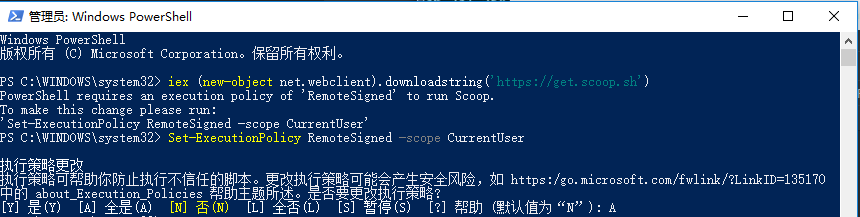
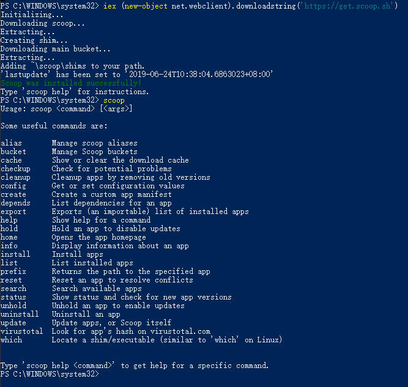
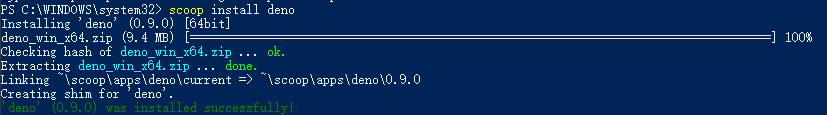
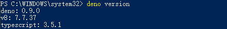
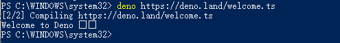

## 起步

### Windows下安装`deno`

官方教程: [https://github.com/denoland/deno_install](https://github.com/denoland/deno_install)

1.安装`scoop`

以管理员身份运行`PowerShell`



`scoop`安装成功



2.使用`scoop`安装`deno`

```
scoop install deno
```


查看`deno`版本




3.运行`Hello World`

```
deno https://deno.land/welcome.ts
```


至此`Windows`下`deno`运行环境安装完成。
