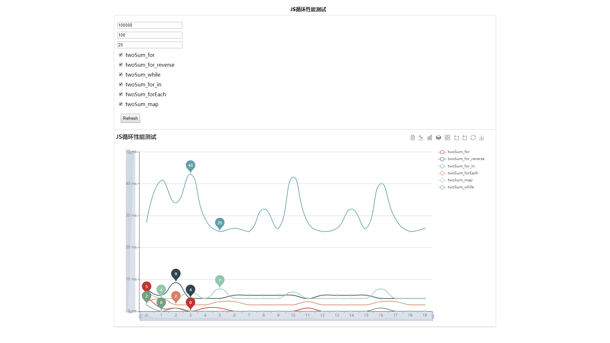
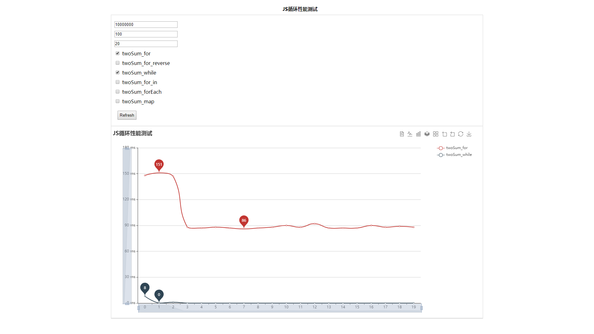

# JS_Loop_Performance

JS 循环性能测试

## 力扣-两数求和
[leetcode two-sum](https://leetcode-cn.com/problems/two-sum/)

通过多次循环求解两数求和来测试JS循环性能。

### 结构

```
.
├── img               截图目录
├── sum.css 
├── sum.html
├── sum.js            主文件
├── sumFuncMap.js     求和方法集合
└── chartOption.js    Echart图表配置文件
```

### 参数

```
  length: 随机生成的数组长度。
  target: 目标求和值
  max: 循环次数，用于多次求值查看性能趋势
```

### 循环方法

```
  twoSum_for: 普通for循环
  twoSum_for_single: 单层普通for循环
  twoSum_for_reverse: 倒序循环
  twoSum_for_in: for...in循环
  twoSum_forEach: forEach循环
  twoSum_map: map循环
  twoSum_while: while循环
```

### 测试结果

**总结：**
  * 最快：twoSum_while、twoSum_for
  * 最慢：twoSum_for_in
  * 耗时排行：twoSum_while < twoSum_for < twoSum_for_reverse < twoSum_forEach < twoSum_map < twoSum_for_in
  * twoSum_for_in 与其他方法耗时差距特别大，MDN提示`for...in`不应该用来遍历数组
  
***所以，一般遍历数组时最好使用普通for循环***

**截图：**

1.循环20次，在随机生成的100000(十万)长度数组里求和值为100的项



2.循环20次，在随机生成的10000000(千万)长度数组里求和值为100的项

*twoSum_while与twoSum_for比较*



### 参考
  * [MDN for...in](https://developer.mozilla.org/zh-CN/docs/Web/JavaScript/Reference/Statements/for...in) 
