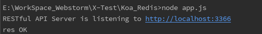
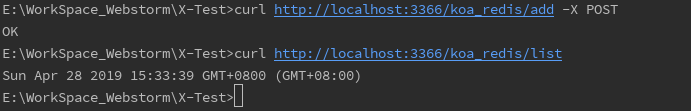
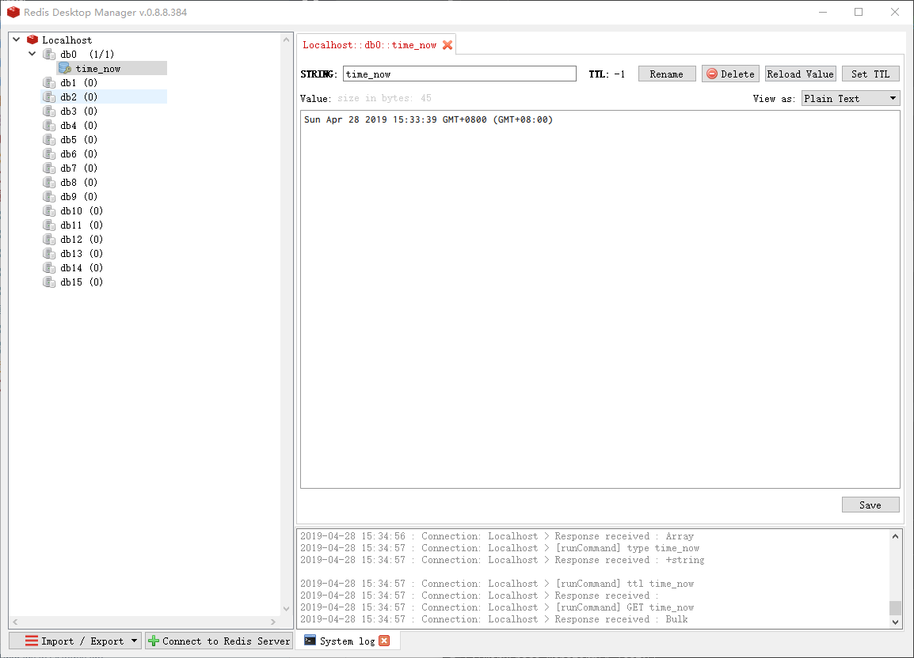

# Koa Redis

## 安装

1.Windows下安装Redis

Redis 官网：[https://redis.io/](https://redis.io/)
Redis 中文网 [http://www.redis.cn/](http://www.redis.cn/)

Github下载：[https://github.com/MicrosoftArchive/redis/releases](https://github.com/MicrosoftArchive/redis/releases)

软件下载完成后执行安装，一路next即可

参考教程：[windows下安装和配置Redis](https://www.jianshu.com/p/e16d23e358c0)

2.启动服务

```
cd ./Koa_Redis
node app.js
```


3.测试接口

```
// 新增
curl http://localhost:3366/koa_redis/add -X POST

// 获取
curl http://localhost:3366/koa_redis/list
```



