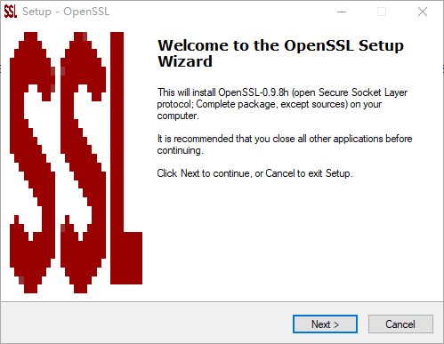

# http2 示例

1.安装openssl



2.配置环境变量


3.生成私钥、证书

```
openssl req -x509 -newkey rsa:2048 -nodes -sha256 -subj '/CN=localhost' -keyout localhost-privkey.pem -out localhost-cert.pem -config "C:\Program Files (x86)\GnuWin32\share\openssl.cnf"

```
