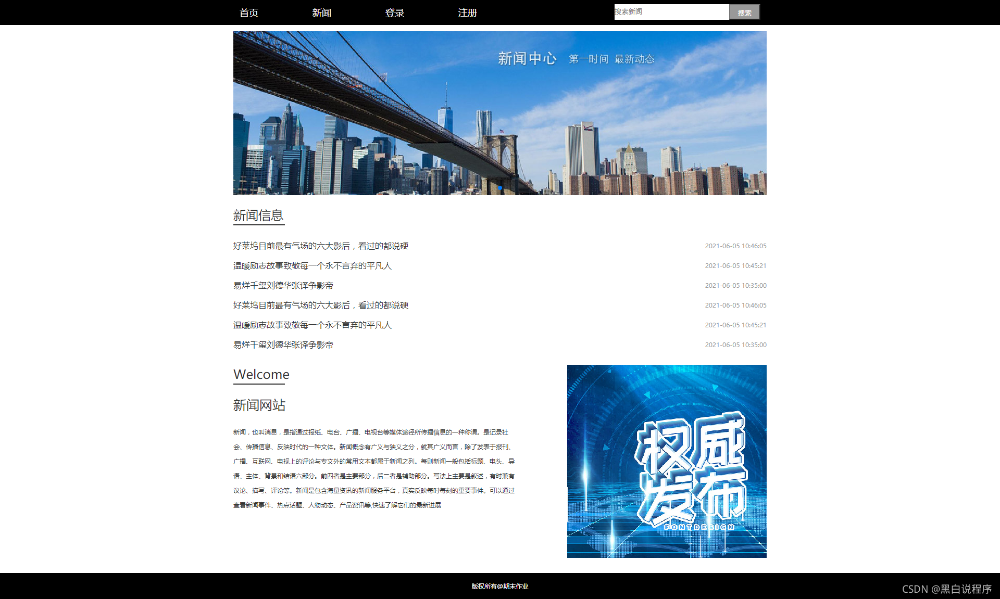
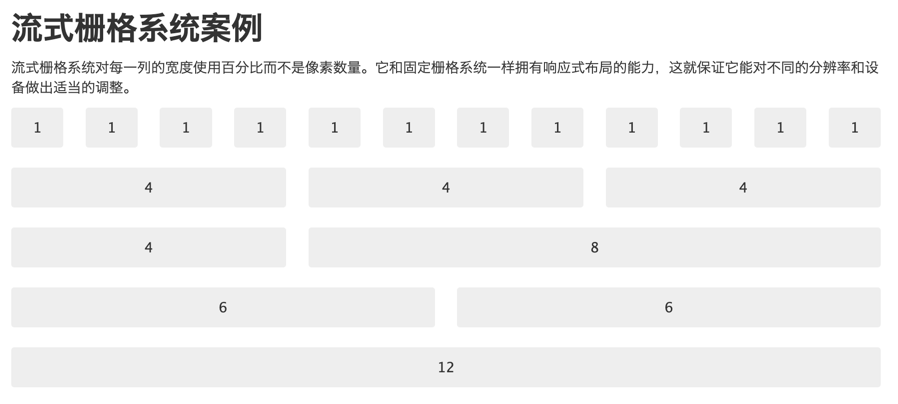
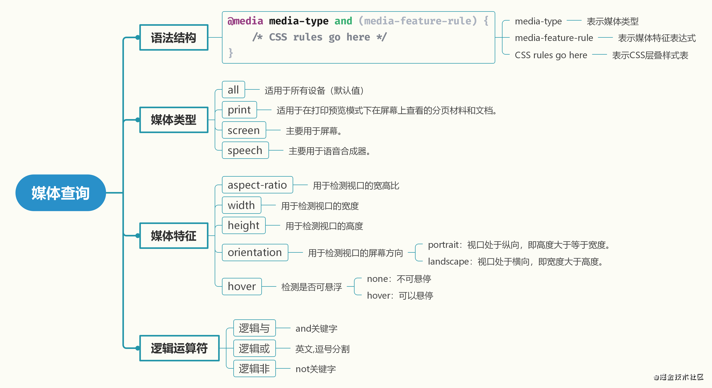
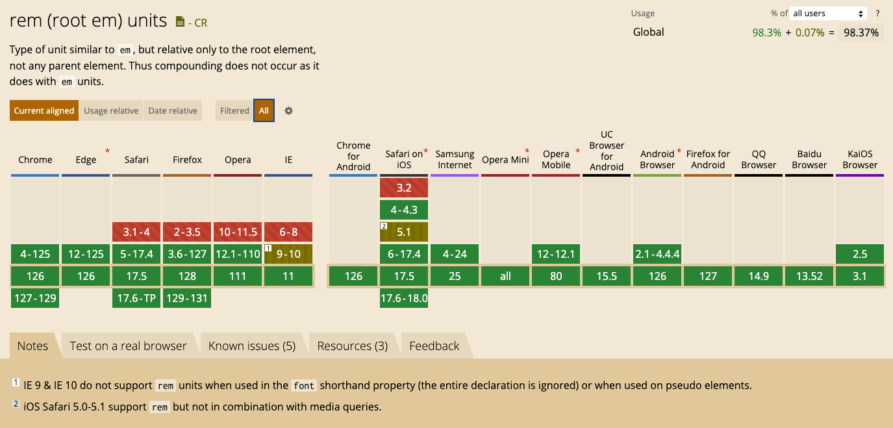
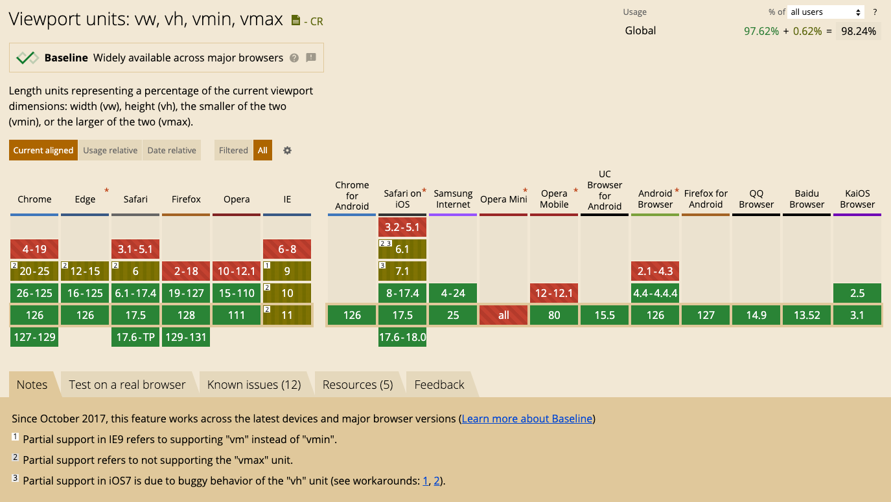
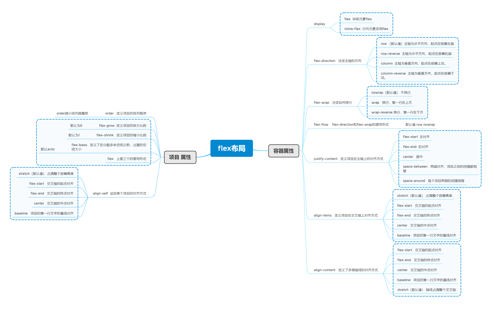

# 响应式布局

## CSS单位

**绝对单位**

这些单位表示固定的长度，不会随上下文或其他元素的变化而改变：
* px (像素)：最常用的单位，表示屏幕上的一个点。
* pt (点)：通常用于印刷媒体，1pt 等于 1/72 英寸。
* cm (厘米)：表示长度的厘米单位。
* mm (毫米)：表示长度的毫米单位。
* in (英寸)：表示长度的英寸单位，1in 等于 2.54 厘米。
* pc (派卡)：1pc 等于 12 点（pt）。

---

**相对单位**

这些单位的值是相对于另一个值来计算的：
* % (百分比)：相对于父元素的长度或自身长度。
* em：相对于元素的字体大小。例如，如果元素的字体大小是 16px，那么 1em 就是 16px。
* rem：相对于根元素的字体大小（通常是 <html> 元素）。
* vw (视口宽度)：相对于视口宽度的百分比，1vw 等于视口宽度的 1%。
* vh (视口高度)：相对于视口高度的百分比，1vh 等于视口高度的 1%。
* vmin：相对于视口宽度和高度中较小者的百分比。
* vmax：相对于视口宽度和高度中较大者的百分比。

---

**其他单位**

* ch：相对于数字“0”的宽度。
* ex：相对于元素的字体 x-height（通常是字母“x”的高度）。

---

**时间线**

* CSS1 (1996年)：引入了像素(px)、点(pt)、厘米(cm)、毫米(mm)、英寸(in)、派卡(pc)、百分比(%)、em、ex等单位。
* CSS3 (2012年)：引入了rem、视口单位(vw、vh、vmin、vmax)和ch单位。

## 布局方式

### 1.静态布局（Static Layout）

**概念：**

传统Web设计，使用固定的宽度和位置单位（通常是像素）来设置元素的尺寸和位置。无论浏览器窗口或设备的大小如何，元素的宽度和位置都保持不变。

**特点：**

* 容易设计和实现，与设计稿1:1
* 网站定宽，视口小于设定宽度会出现滚动条
* 主容器居中布局，使用 `margin: 0 auto;`
* `1024×768` 以及更高分辨率的屏幕选择 `960px` 作为网页内容主容器的像素宽度
* `800×600` 分辨率下的主容器最佳显示宽度是 `760px`
* 不适合需要适配多种设备的现代网页设计，M站单独开发，独立部署

**使用场景：** 适用于设计精确、设备规格统一的环境，如某些企业内部系统。

### 2.流式布局（Liquid Layout）

流式布局（Liquid）的特点（也叫"Fluid") 是页面元素的宽度按照屏幕分辨率进行适配调整，但整体布局不变。
代表作栅栏系统 [Bootstrap](https://v2.bootcss.com/scaffolding.html#grid)。

**概念：**

流式布局使用相对单位（如百分比）来设置元素的宽度和位置，使得布局能够随浏览器窗口的大小进行调整。

**特点：**

* 布局能根据屏幕宽度自动调整，页面里元素的大小会变化而但布局不变
* 不会出现滚动条，页面内容会随窗口大小变化而重排
* 使用%百分比定义宽度，高度大都是用px来固定住
* 屏幕尺寸跨度太大时无法全面兼容，对于非常大或非常小的屏幕可能需要额外处理

**使用场景：** 适用于希望在大部分设备上都能有良好显示效果的网页。

[Bootstrap 栅格系统](https://oxoyo.co/Bootstrap-Tutorial/lesson/lesson-1.html)

[40款栅格神器](https://www.uisdc.com/40-flexible-grid-tools)

### 3.自适应布局（Adaptive Layout）

**概念：**

自适应布局通过使用CSS `@media` 媒体查询，根据不同的设备和屏幕尺寸加载特定的样式表。页面会针对预定义的断点进行调整，即创建多个静态布局，每个静态布局对应一个屏幕分辨率范围

**特点：**

* 为不同的设备和屏幕尺寸定义多个固定布局。
* 每个断点对应一个特定的布局。
* 设计和开发需要考虑多个版本的布局。

**使用场景：** 适用于需要在几个特定设备和分辨率上呈现良好的布局。

### 4.响应式布局 (Responsive Layout)

**概念：**

响应式布局结合了自适应布局和流式布局的优点，通过CSS媒体查询和相对单位来实现跨设备和屏幕尺寸的灵活适配。

**特点：**

* 使用媒体查询和流式布局结合，针对不同屏幕尺寸进行调整。
* 适配性强，能够提供一致的用户体验。
* 设计和开发复杂度较高，但现代网页设计普遍采用。

**使用场景：** 适用于现代多设备环境，特别是需要在手机、平板和桌面设备上都有良好表现的网站。

### 5.弹性布局 (Elastic Layout)

**概念：**

弹性布局使用相对单位（如em或rem）来设置元素的尺寸，使得布局能够根据字体大小进行调整。

**特点：**

* 布局能根据用户设置的字体大小进行调整。
* 提供更好的可访问性和用户体验。
* 设计和实现需要对字体和排版有良好理解。

**使用场景：** 适用于希望根据用户字体大小设置调整布局的网站，特别是注重可访问性的网站。

### 6.Flex布局 (Flex Layout)

**概念：**

弹性布局（Flexbox）是CSS3中引入的一种布局模型，旨在为复杂的布局需求提供更强大的控制。Flexbox容器（flex container）和其子元素（flex items）可以轻松地创建自适应且灵活的布局。

**特点：**

* 方向控制：可以指定子元素在主轴（水平或垂直方向）上的排列方向（row或column）。
* 排列和对齐：通过简单的属性（如justify-content、align-items、align-content等）控制子元素的排列、对齐和分布。
* 弹性伸缩：子元素可以根据可用空间进行伸缩（通过flex-grow、flex-shrink和flex-basis属性）。
* 顺序控制：可以使用order属性轻松改变子元素的显示顺序，而无需改变DOM结构。
* 容器和项目独立性：子元素的大小和位置可以独立于其内容和兄弟元素，创建更复杂的响应式布局。

**使用场景：** Flexbox特别适合用于需要在一个维度上排列元素的布局，如水平导航条、水平和垂直居中、动态调整的卡片布局等。适合小范围内的一维布局，而非整个页面的布局。

[阮一峰：Flex 布局教程](https://www.ruanyifeng.com/blog/2015/07/flex-grammar.html)

### 7.视口单位布局 (Viewport Units Layout)

**概念：**

视口单位（viewport units）是CSS中定义的相对单位，用于相对于视口（viewport）尺寸设置元素的大小。视口单位主要包括vw（视口宽度）、vh（视口高度）、vmin（视口宽度和高度的较小值）和vmax（视口宽度和高度的较大值）。
单位介绍：

* 1vw：等于视口宽度的1%。
* 1vh：等于视口高度的1%。
* 1vmin：等于视口宽度和高度的较小值的1%。
* 1vmax：等于视口宽度和高度的较大值的1%。

**特点：**

* 响应性强：元素大小会随视口的变化而调整，适应不同设备的屏幕尺寸。
* 简洁：使用视口单位可以减少媒体查询的数量，简化响应式设计。
* 便捷：特别适合全屏背景图像、全屏幕组件、视频和其他需要占据视口特定比例的元素。

**使用场景：**

* 创建全屏幕的背景或组件。
* 设计需要占据视口特定比例的元素，如弹出窗口、横幅广告、全屏幕的表单等。
* 在需要根据视口尺寸动态调整的布局中使用。

[postcss-px-to-viewport](https://www.npmjs.com/package/postcss-px-to-viewport)

## 参考资料

[响应式设计](https://developer.mozilla.org/zh-CN/docs/Learn/CSS/CSS_layout/Responsive_Design)

[自适应设计基础知识](https://web.dev/articles/responsive-web-design-basics?hl=zh-cn)

[静态布局、自适应布局、流式布局、响应式布局、弹性布局等的概念和区别](https://cloud.tencent.com/developer/article/1635215)

[网页设计中的布局](http://www.lanlanwork.com/blog/?post=5293)

[移动端适配方案](https://juejin.cn/post/7345695255847501833)
